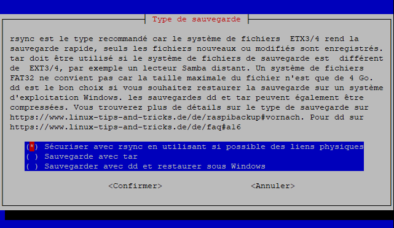

  

<p align="center">
  
</p>

# raspiBackup - Backup and restore your running Raspberries

* Primary features
  * Unattended full or incremental system backup with no shutdown of the system.
  * No manual intervention required. Backups are created via cron over night.
  * Important services can be stopped before starting the backup and will be restarted when the backup finished.
  * Any device mountable on Linux can be used as backup space (local USB disk, remote nfs drive, remote samba share, remote ssh server using sshfs, remote ftp server using curlftpfs, webdav drive using davfs, ...).
  * Messages and completion status of backup run can be send in an eMail or to Telegram.
  * Extensionpoints allow to execute any additional logic at various steps in the backup and restore process.
* Restore
  * Restore any of the created backup versions to get a system which boots up immediately.
  * Migrate a SD card backup image to an USB device during restore.
* Backup strategies
  * Number of backup versions to keep is configurable.
  * Smart recycle backup strategy available (e.g. save backups of last 7 days, last 4 weeks, last 12 months and last n years) - also known as grandfather, father and son backup rotation principle.
* Linux backup tools used
  * Standard Linux backup tools dd, tar and rsync are available to create a backup.
  * dd and tar are full backups. rsync uses hardlinks for incremental backups.
  * dd backups can be restored with Windows tools.
* Installation 
  * Menu driven installer installs and configures raspiBackup with all major options to get raspiBackup up and running in 5 minutes. Much more configuration options can be configured in a configuration file.
* Usability
  * National language support:
    * English (Default)
    * German
    * Finnish
    * Chinese
    * French
    * Many thanks to all the raspiBackup users who translated raspiBackup messages into their native language 👍 
    * Anybody who is interested to add language support for his native language is invited to read [this page](https://www.linux-tips-and-tricks.de/en/raspibackupcategorye/603-raspibackup-local-language-support-for-languages-other-than-de-and-en-l10n/)
  * More than 270 messages inform about configuration and environment mismatches and runtime errors
* Reliability 
  * Automated regressiontests make sure a new release will still backup and restore successfully. 
* Servicability
  * Extensive logging helps to isolate backup/restore issues. 
* Much more features (see below).

## Note
**raspiBackup is supported only for RaspberryOS as operating system and Raspberry hardware. raspiBackup runs also successfully on other Raspberry compatible hardware and other Linux distros but any support request on these unsupported environments will be rejected. Just try it and be happy if it works but don't ask for any support.**

## Documentation

### English
* [Installation](https://www.linux-tips-and-tricks.de/en/backup/quickstart-rbk/)
* [Users guide](https://www.linux-tips-and-tricks.de/en/backup)
* [FAQ](https://www.linux-tips-and-tricks.de/en/faq)
* [Error messages, root causes and suggested actions](https://www.linux-tips-and-tricks.de/en/faq/rmessages/)
* [Smart recycle backup strategy](https://www.linux-tips-and-tricks.de/en/backup/smart-recycle/)
* [Use synology as backup space](https://www.linux-tips-and-tricks.de/en/backup/synology-usage/)

### German
* [Installation](https://www.linux-tips-and-tricks.de/de/raspibackup/schnellstart-rbk/)
* [Benutzerhandbuch](https://www.linux-tips-and-tricks.de/de/raspibackup)
* [FAQ](https://www.linux-tips-and-tricks.de/de/faq)
* [Fehlermeldungen, Ursachen und Behebung](https://www.linux-tips-and-tricks.de/de/faq/fehlermeldungen/)
* [Intelligente Rotationsstrategie](https://www.linux-tips-and-tricks.de/de/raspibackup/rotationsstrategie/)
* [Benutzung von Synology als Backupspace](https://www.linux-tips-and-tricks.de/de/raspibackup/benutzung-von-synology/)

### French

This README was translated into [French](README_fr). Credits to [mgrafr](https://github.com/mgrafr) for his translation work.

## Installer

The installer uses menus, checklists and radiolists similar to raspi-config and helps to install and configure major options of raspiBackup and in 5 minutes the first backup can be created.




### Installer demo


Installation of raspiBackup will started with following command:

`curl -s https://raw.githubusercontent.com/framps/raspiBackup/master/installation/install.sh | sudo bash`

## Donations

raspiBackup is maintained just by me - framp. If you find raspiBackup useful please donate to support future development and acknowledge support. For details how to donate see [here](https://www.linux-tips-and-tricks.de/en/donations/)

## Feature requests

Anybody is welcome to create feature requests in github. They are either immediately scheduled for the next release or moved into the [backog](https://github.com/framps/raspiBackup/issues?q=is%3Aissue+is%3Aclosed+label%3ABacklog). The backlog will be reviewed every time a new release is planned and some issues are picked up and will be implemented in the next release. If you find some features useful just add a comment to the issue with :+1:. This helps to prioritize the issues in the backlog.

## Much more detailed documentation

 * [English](https://www.linux-tips-and-tricks.de/en/all-pages-about-raspibackup/)
 * [German](https://www.linux-tips-and-tricks.de/de/alles-ueber-raspibackup/)

## Social media

 * [Youtube](https://www.youtube.com/channel/UCnFHtfMXVpWy6mzMazqyINg) - Videos in English and German
 * [Twitter](https://twitter.com/search?q=%23raspiBackup&src=typed_query) - News and announcements - English only
 * [Facebook](https://www.facebook.com/raspiBackup) - News, discussions, announcements and misc background information in English and German

## Miscellaneous sample scripts [(Code)](https://github.com/framps/raspiBackup/tree/master/helper)

* Sample wrapper scripts to add any activities before and after backup [(Code)](https://github.com/framps/raspiBackup/blob/master/helper/raspiBackupWrapper.sh)

* Sample wrapper script which checks whether a nfsserver is online, mounts one exported directory and invokes raspiBackup. If the nfsserver is not online no backup is started. [(Code)](https://github.com/framps/raspiBackup/blob/master/helper/raspiBackupNfsWrapper.sh)

* Sample script which restores an existing tar or rsync backup created by raspiBackup into an image file and then shrinks the image with [pishrink](https://github.com/Drewsif/PiShrink). Result is the smallest possible dd image backup. When this image is restored via dd or windisk32imager it's expanding the root partition to the maximum possible size. [(Code)](https://github.com/framps/raspiBackup/blob/master/helper/raspiBackupRestore2Image.sh)

* Convenient helper script to restore a backup. [(Code)](https://github.com/framps/raspiBackup/blob/master/helper/raspiBackupRestoreHelper.sh)

## Sample extensions

There exist [sample extesions](./extensions) for raspiBackup which report for example memory usage, CPU temperature, disk usage and more. There exist also [user provided extensions](./extensions_userprovided). 

## Systemd

Instead of cron systemd can be used to start raspiBackup. See [here](installation/systemd) (thx [Hofei](https://github.com/Hofei90)) for details. 

# REST API Server proof of concept

Allows to start raspiBackup from a remote system or any web UI.
1. Download executable from [RESTAPI directory](https://github.com/framps/raspiBackup/tree/master/RESTAPI)
2. Create a file /usr/local/etc/raspiBackup.auth and define access credentials for the API. For every user create a line userid:password
3. Set file attributes for /usr/local/etc/raspiBackup.auth to 600
4. Start the RESTAPI with ```sudo raspiBackupRESTAPIListener```. Option -a can be used to define another listening port than :8080.
5. Use ```curl -u userid:password -H "Content-Type: application/json" -X POST -d '{"target":"/backup","type":"tar", "keep": 3}' http://<raspiHost>:8080/v0.1/backup``` to kick off a backup.
