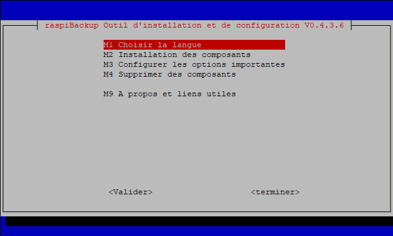
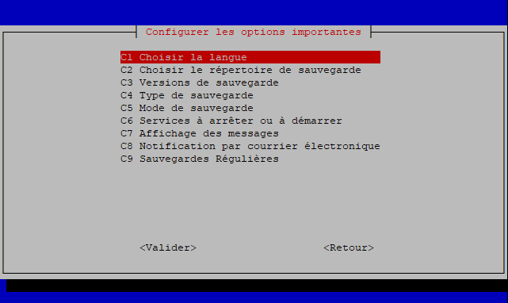

  

# Create and keep multiple backup versions of your running Raspberries 
 
 

***
If you use raspiBackup to backup your Raspberries - I appreciate to be sponsored on [GitHub](https://github.com/sponsors/framps) or visit [this page]((https://framps.github.io/raspiBackupDoc/introduction.html?highlight=donation#donations) which lists alternate ways to donate.
***

#### A high level summary is available on [this page](https://raspibackup.linux-tips-and-tricks.de/en/home/).

* Primary features
  * Unattended full or incremental system backup with no shutdown of the system.
  * Backup types 
    * rsync
    * tar/tgz
    * dd/ddz
  * No manual intervention required. Backups are created via systemd timer over night.
  * Important services can be stopped before starting the backup and will be restarted when the backup finished.
  * Any device mountable on Linux can be used as backup space (local USB disk, remote nfs drive, remote samba share, remote ssh server using sshfs, remote ftp server using curlftpfs, webdav drive using davfs, ...).
  * Supported systems
    * SD card only
    * USB disk or SSD only (USB boot mode)
    * SD card for boot and USB disk or SSD for root system (for older Raspberries which don't support USB boot)
  * Messages and completion status of backup sent via eMail, Telegram. Pushover or Slack
  * Any additional logic can be added at various steps in the backup and restore process via extensionpoints.
  * Restored backup will boot immediately.
* Backup strategies
  * Number of backup versions to keep configurable either for sum of backups or on individual backup types
  * Smart recycle backup strategy available (e.g. save backups of last 7 days, last 4 weeks, last 12 months and last n years) - also known as grandfather, father and son backup rotation principle. The smart recycle strategy algorithm was inspired by Manuel Dewalds great article [Automating backups on a Raspberry Pi NAS](https://opensource.com/article/18/8/automate-backups-raspberry-pi)
  * Manual backups allow to create a kind of snapshot (so called raspiBackup snapshots) of the system just before major updates are done on a system.
* Linux backup tools used
  * Standard Linux backup tools dd, tar and rsync can be used to create a backup.
  * dd and tar are full backups. rsync uses hardlinks for incremental backups.
  * dd backups can be restored with Windows tools.
* Installation 
  * Menu driven installer installs and configures raspiBackup with all major options to get raspiBackup up and running in 5 minutes. Much more options can be configured in a configuration file.
* Usability
  * National language support:
    * English (Default)
    * German
    * Finnish ([teemue](https://github.com/teemue))
    * Chinese ([GoogleBeEvil](https://github.com/GoogleBeEvil))
    * French ([mgrafr](https://github.com/mgrafr))
    * Many thanks to the folks above who translated raspiBackup messages into their native language 👍 
      * Any translation help to add other languages to raspiBackup is greatly appreciated. Please read [this page](https://www.linux-tips-and-tricks.de/en/raspibackupcategorye/603-raspibackup-local-language-support-for-languages-other-than-de-and-en-l10n/)
  * More than 270 messages inform about
    *  Backup progress 
    *  Configuration mismatches
    *  Environment mismatches
    *  Runtime errors
* Reliability 
  * Automated regressiontests make sure a new release will still backup and restore successfully. 
* Serviceability
  * Extensive logging helps to locate and fix backup/restore issues 
* Much more features available (see below).

## Support

raspiBackup is supported **only** for RaspberryOS and Ubuntu as operating system and **only** for Raspberry hardware. raspiBackup runs successfully also on other Raspberry compatible hardware and other Linux distros but any support request on these unsupported environments will be rejected. Just give it a try and be happy if it works but don't ask for any support. For details see [here](https://framps.github.io/raspiBackupDoc/supported-hardware-and-software.html).

Support is also given **only** for raspiBackup specific issues. For general Linux related questions please use other information sources. 

* [Create issues](https://github.com/framps/raspiBackup/issues/new/choose)
* [Ask questions](https://github.com/framps/raspiBackup/discussions)

## Documentation

### English
* [Installation](https://www.linux-tips-and-tricks.de/en/installation/)
* [Users guide](https://www.linux-tips-and-tricks.de/en/backup)
* [FAQ](https://www.linux-tips-and-tricks.de/en/faq)
* [Error messages, root causes and suggested actions](https://linux-tips-and-tricks.de/en/raspibackupmessagese/)
* [Smart recycle backup strategy](https://linux-tips-and-tricks.de/en/smart-recycle/)
* [Use synology as backup space](https://linux-tips-and-tricks.de/en/synology/)

### German
* [Installation](https://linux-tips-and-tricks.de/de/installation/)
* [Benutzerhandbuch](https://linux-tips-and-tricks.de/de/raspibackup/)
* [FAQ](https://linux-tips-and-tricks.de/de/faq/)
* [Fehlermeldungen, Ursachen und Behebung](https://linux-tips-and-tricks.de/de/raspibackupmeldungen/)
* [Intelligente Rotationsstrategie](https://linux-tips-and-tricks.de/de/rotationsstrategie/)
* [Benutzung von Synology als Backupspace](https://linux-tips-and-tricks.de/de/synology/)

### French

This README was translated into [French](README_fr). Credits to [mgrafr](https://github.com/mgrafr) for his translation work.

## Installer

The installer uses menus, checklists and radiolists similar to raspi-config and helps to install and configure major options of raspiBackup and in 5 minutes the first backup can be created.

### Installer demo

Installation of raspiBackup is started with following command:

`curl -o install -L https://raw.githubusercontent.com/framps/raspiBackup/master/installation/install.sh; sudo bash ./install`

## Donations

raspiBackup is maintained just by me - framp. If you find raspiBackup useful please donate to support future development and acknowledge support. For details how to donate see [here](https://www.linux-tips-and-tricks.de/en/donations/)

## Much more detailed documentation

 * [English](https://linux-tips-and-tricks.de/en/all-raspibackup-articles/)
 * [German](https://linux-tips-and-tricks.de/de/alle-raspibackup-artikel/)

## Social media

 * [Youtube](https://www.youtube.com/channel/UCnFHtfMXVpWy6mzMazqyINg) - Videos in English and German
 * [Twitter](https://twitter.com/search?q=%23raspiBackup&src=typed_query) - News and announcements - English only
 * [Facebook](https://www.facebook.com/raspiBackup) - News, discussions, announcements and misc background information in English and German
 * [Reddit](https://www.reddit.com/r/raspiBackup/) - News, announcements 

## Miscellaneous sample scripts [(Code)](https://github.com/framps/raspiBackup/tree/master/helper)

* Sample wrapper scripts to add any activities before and after backup [(Code)](https://github.com/framps/raspiBackup/blob/master/helper/raspiBackupWrapper.sh)

* Sample wrapper script which checks whether a nfsserver is online, mounts one exported directory and invokes raspiBackup. If the nfsserver is not online no backup is started. [(Code)](https://github.com/framps/raspiBackup/blob/master/helper/raspiBackupNfsWrapper.sh)

* Sample script which restores an existing tar or rsync backup created by raspiBackup into an image file and then shrinks the image with [pishrink](https://github.com/Drewsif/PiShrink). Result is the smallest possible dd image backup. When this image is restored via dd or windisk32imager it's expanding the root partition to the maximum possible size. [(Code)](https://github.com/framps/raspiBackup/blob/master/helper/raspiBackupRestore2Image.sh)

* Convenient helper script to backup and restore a backup. [(Code)](https://github.com/framps/raspiBackup/blob/master/helper/raspiBackupDialog.sh)

* Sample script which creates a backup and a clone as a cold standby boot medium[(Code)](https://github.com/framps/raspiBackup/blob/master/helper/raspiBackupAndClone.sh)

## Sample extensions

There exist [sample extensions](./extensions) for raspiBackup which report for example memory usage, CPU temperature, disk usage and more. There exist also [user provided extensions](./extensions_userprovided). 
